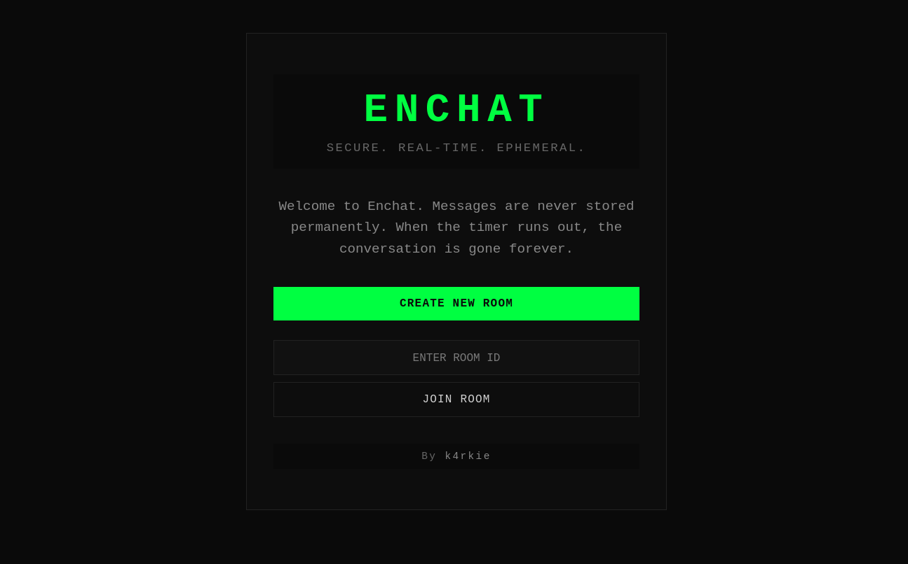

# Enchat

A minimalist, high-security, ephemeral chat application built with Bun and WebSockets.

## The Concept

Enchat is designed for time-sensitive conversations. It operates on a "zero-persistence" model where privacy is enforced by time.

- **Ephemeral by Default:** Chatrooms exist only for a set duration. Once the timer expires, the room and its entire history are purged.
- **No Persistence:** Messages are never stored in a database. Data lives only in memory and is cleared when the session ends.
- **On-Demand Rooms:** Users can generate unique, temporary room IDs to invite participants.

## Core Features

- **Real-time Synchronization:** Instant message delivery via WebSockets.
- **Join/Create Logic:** Simple entry via unique Room IDs.
- **Session Countdown:** Visible timer indicating when the chat will be destroyed.

## Tech Stack

- **Runtime:** [Bun](https://bun.sh)
- **Backend:** TypeScript / Express
- **Frontend:** Vanilla HTML/CSS/JS
- **Communication:** WebSockets
